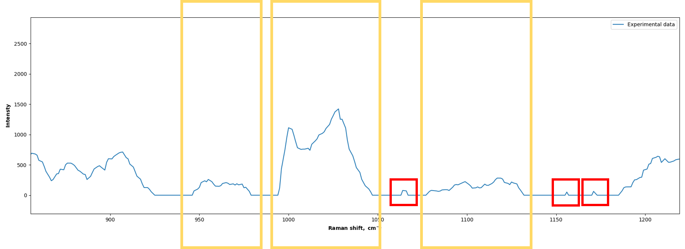
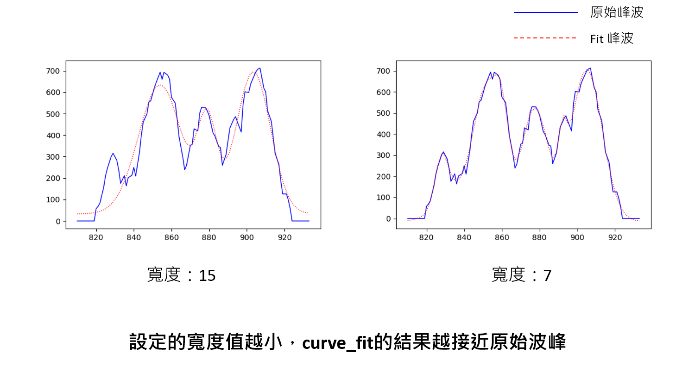
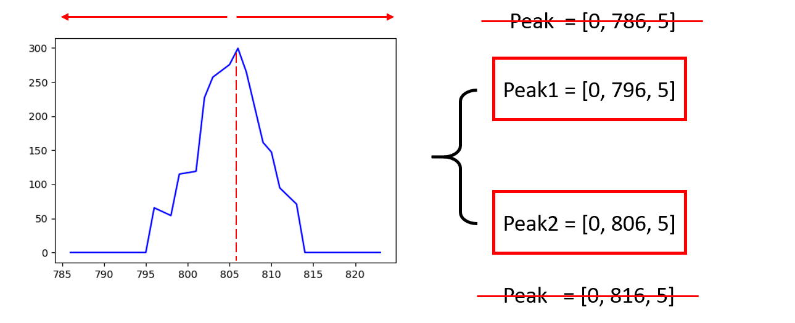
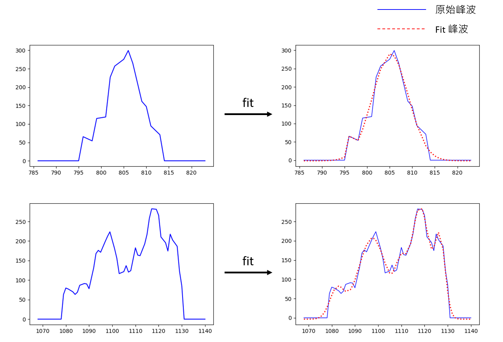
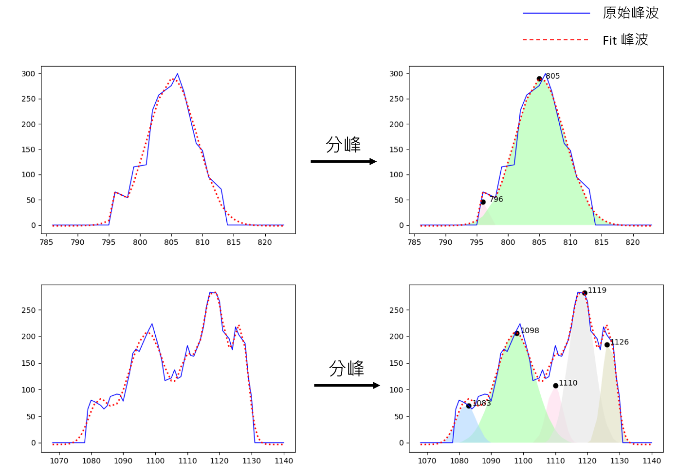

# 拉曼光譜重疊峰的分峰擬合

## 實作目的
* 使原始光譜曲線擬合
* 找到在重疊峰中可能包含的單峰

## 實作流程
 

## Step 1. 光譜前處理
1. <b>將光譜高度 < 50的點設為0</b> 
    ##### (下圖中的`藍色線段`為原始的光譜，`紅色線段`為處理後的光譜)
   
2. <b>切割光譜</b> 
    * 從 高度0 開始到下一個 高度0 切一段   (如下圖 `黃色框框` ) 
    * 若切出來的峰最高點 <200 則忽略不算   (如下圖 `紅色框框` )   
     
  
## Step 2. 設置參數
  可調整參數：[ <b>強度</b> (amp)，<b>位置</b> (ctr)，<b>寬度</b> (wid) ] 
  * <b>強度影響：</b> 
  經多次測試後，發現強度設置的大小對於最終結果並無太大的影響。 
  為了能使程式自動化，強度<b>一律設為0</b>。
     
  
  * <b>寬度影響：</b>
 
  
  * <b>參數設置：</b> 
    <b>強度：</b> 0 
    <b>寬度：</b> 從 <b>10</b> 開始，若無法擬合 --> 寬度 + 2 
    <b>位置：</b> 從該峰的最高點往左右兩端，每隔一個寬度取一組參數。 取到x座標的高度等於0為止  
     
      ##### ( 上圖中，當x座標為 786 和 816 時，高度 = 0，因此 peak = [0, 786, 5] 及 peak = [0, 816, 5] 不採用。 )

## Step 3. 曲線擬合
   利用高斯曲線擬合的方式，使原始光譜達到降噪的效果
   
  
## Step 4. 分峰
 
